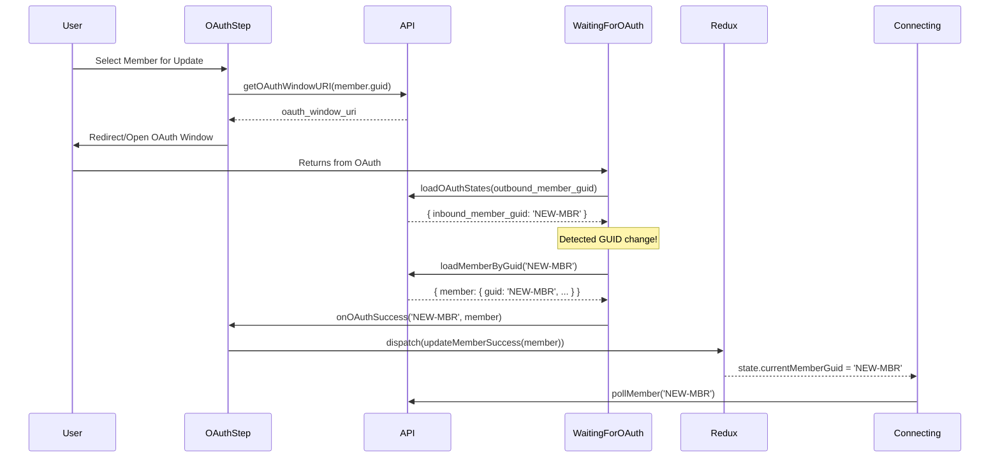

# Implementation Plan: CTT-178 - Restore OAuth Member Update Flow and Dynamic GUID Synchronization

## 1. Analysis Summary

- **Type:** New Feature / Architectural Initiative (Reintroduction of flow)
- **Complexity:** Medium
- **Impact:** Critical for non-OAuth to OAuth migrations; ensures session integrity when member GUIDs change during OAuth.
- **Confidence Level:** High - The proposed solution leverages existing Redux actions and RxJS patterns within the widget.

## 2. Affected Code Areas

### Primary Files

- `src/views/oauth/OAuthStep.js` - Re-enable update flow and handle fetched member data.
- `src/views/oauth/WaitingForOAuth.js` - Implement dynamic member GUID detection and fetching.

### New Files

- None.

## 3. Solution Architecture



## 4. Implementation Plan

### Phase 1: Restore OAuth Update Flow

1. **Modify `src/views/oauth/OAuthStep.js`**: Update the `useEffect` that starts the OAuth flow to check for an existing `member` from Redux state if no `pendingOauthMember` is found.
2. **Re-enable `getOAuthWindowURI`**: Ensure that if `member.guid` exists, the flow proceeds to fetch the OAuth URI instead of defaulting to `api.addMember`.
   [Validation Checkpoint: Start Connect with `current_member_guid` for an OAuth-compatible institution. Verify it lands on `OAuthStep` and successfully generates the URI for that member.]

### Phase 2: Dynamic Member Synchronization

1. **Update `src/views/oauth/WaitingForOAuth.js`**:
   - Modify the `oauthStateCompleted$` stream.
   - After polling succeeds, check if `inbound_member_guid` differs from the initial `member.guid`.
   - If different, use `api.loadMemberByGuid` to fetch the updated member record.
   - Update the response object to include the fetched `member`.
2. **Error Handling**: If `loadMemberByGuid` fails, return an error state to trigger the OAuth error view.
   [Validation Checkpoint: Mock `loadOAuthStates` to return a different `inbound_member_guid`. Verify that `loadMemberByGuid` is called with the new GUID.]

### Phase 3: State Reconciliation

1. **Update `OAuthStep.js` callbacks**:
   - Update `handleOAuthSuccess` to accept `(memberGuid, member = null)`.
   - If `member` is provided, dispatch `connectActions.updateMemberSuccess({ item: member })`.
   - This ensures the Redux store has the new member and `currentMemberGuid` is updated before moving to the `CONNECTING` step.
     [Validation Checkpoint: Complete an OAuth flow where the GUID changes. Verify that the `Connecting` view shows the correct institution name and begins polling for the NEW member GUID.]

## 5. Proposed Code Changes (The Spike)

### `src/views/oauth/OAuthStep.js`

```diff
<<<<
    if (pendingOauthMember) {
      // If there is a pending oauth member, don't create a new one, use that one
      member$ = of(pendingOauthMember)
    } else {
====
    if (member && member.guid) {
      // Use the currently active member (supports Update flows and re-using a member created in this session)
      member$ = of(member)
    } else if (pendingOauthMember) {
      // If no active member, look for a pending oauth member for this institution
      member$ = of(pendingOauthMember)
    } else {
>>>>
```

```diff
<<<<
  function handleOAuthSuccess(memberGuid) {
    closeOAuthWindow()
    dispatch(connectActions.handleOAuthSuccess(memberGuid))
  }
====
  function handleOAuthSuccess(memberGuid, member = null) {
    closeOAuthWindow()
    if (member) {
      dispatch(connectActions.updateMemberSuccess(member))
    }
    dispatch(connectActions.handleOAuthSuccess(memberGuid))
  }
>>>>
```

### `src/views/oauth/WaitingForOAuth.js`

```diff
<<<<
      map((pollingState) => {
        const oauthState = pollingState.currentResponse

        return {
          error: oauthState.auth_status === OauthState.AuthStatus.ERRORED,
          errorReason: OauthState.ReadableErrorReason[oauthState.error_reason],
          memberGuid: oauthState.inbound_member_guid,
        }
      }),
====
      mergeMap((pollingState) => {
        const oauthState = pollingState.currentResponse
        const inboundMemberGuid = oauthState.inbound_member_guid

        if (oauthState.auth_status === OauthState.AuthStatus.ERRORED) {
          return of({
            error: true,
            errorReason: OauthState.ReadableErrorReason[oauthState.error_reason],
            memberGuid: inboundMemberGuid || member.guid,
          })
        }

        if (inboundMemberGuid && inboundMemberGuid !== member.guid) {
          return defer(() => api.loadMemberByGuid(inboundMemberGuid, clientLocale)).pipe(
            map((resp) => ({
              error: false,
              memberGuid: inboundMemberGuid,
              member: resp.member,
            })),
            catchError(() =>
              of({
                error: true,
                errorReason: 'Failed to fetch updated member information',
                memberGuid: inboundMemberGuid,
              }),
            ),
          )
        }

        return of({
          error: false,
          memberGuid: inboundMemberGuid || member.guid,
        })
      }),
>>>>
```

## 6. Validation & Testing

- [ ] **Unit Tests:**
  - `OAuthStep-test.js`: Verify update flow re-activation.
  - `WaitingForOAuth-test.js`: Verify dynamic GUID detection and member fetching.
- [ ] **Integration Tests:** Use MSW to simulate a migration scenario where GUID changes from `MBR-OLD` to `MBR-NEW`.
- [ ] **Acceptance Criteria:**
  - OAuth update flow is restored.
  - State is synchronized with `incoming_member_id`.
  - Redux store correctly integrates new members.

## 7. Risk Mitigation

- **Risk:** Mangled credentials if updating an existing OAuth member. -> **Mitigation:** The re-enabled flow is specifically for migrations and updates where the backend (Firefly DC-3040) is now handling the credential/member logic safely.
- **Risk:** Infinite polling if new member GUID is invalid. -> **Mitigation:** The fetch step for the new member ensures it exists before proceeding to `Connecting`.
- **Rollback Plan:** Revert changes to `OAuthStep.js` to restore the "always create new member" behavior.

**Next Step**: Run `/planning:breakdown-plan CTT-178` to break this plan down into actionable tasks.
